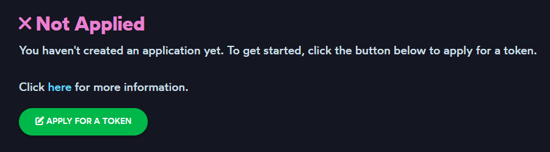
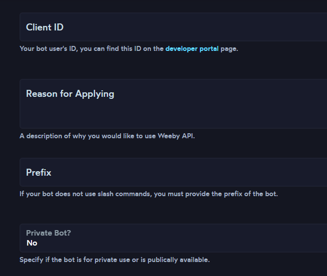

# Obtaining an API Token

## Method 1: Using the Weeby API Discord Bot

First, join our [Discord Server](https://weebyapi.xyz/discord) and click "Accept Invite".

Run the `/apply` command in the `#weebyapi-commands` channel.

A modal will send which will ask you fill in all the required options. Depending on the condition, an error will return if you don't fill them in properly.

::: warning 
Make sure you are eligible for a token. See [this article](/weeby-api/requirements) for the requirements to be accepted.
:::

Once you've run the command, an ephemeral response will be sent **that you can only see**. This is to ensure that other bots and users cannot read information about your application, and can then be safely dismissed.

All you need to do now is wait for a response from the bot as the team will be reviewing the applications. 

::: danger WARNING
Stay in our support server to ensure that you can receive your Token and DM messages. If you leave the server during the review process, your application will be automatically rejected.
:::

## Method 2: Using our Dashboard Application Page

Login to the [Weeby API Dashboard](https://weebyapi.xyz/dashboard) using your Discord Account. Then, click on [Apply for a Token](https://weebyapi.xyz/dashboard/apply).

Fill in the following blank fields:
- **Client ID** - This is your Discord Bot's user ID, you can find this on the [developer portal](https://discord.com/developers/applications) page.
- **Server Count** - This is the amount of servers your bot is in at the time of applying. The value must be 25 or more servers, **do not provide a false server count**.
- **Reason for Applying** - This is where you need to explain why you want to use Weeby API. Providing something descriptive will help the reviewers understand what your bot does.

Once all the fields are filled, scroll to the bottom and read the information shown before the submit button.

Once done, click the `Submit` button and the page will refresh. You will automatically join our Discord Server where all you need to do is wait for a response from the bot as the team will be reviewing the applications. 

::: danger WARNING
Stay in our support server to ensure that you can receive your Token and DM messages. If you leave the server during the review process, your application will be automatically rejected.
:::