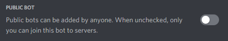

# Requirements

This API is meant to be a tool for Discord Bot Developers. So that means that you need to create a Discord Account in order to apply for a Weeby API Token.

The team will be reviewing most of your bot's features so make sure it is online and the ID provided is a valid Bot ID. Applications that don't meet the requirements will get a DM response letting them know that their application was denied. If you have the feeling that your bot has reached these requirements, feel free to re-apply again.

You will need to use the `/apply` command on this server or visit the [Dashboard Application Page](https://weebyapi.xyz/dashboard/apply) to apply for a Weeby API token. The criteria is as follows:

## Public Discord Bots
- Must have at least **20** or more servers.
- Must be **online** when we review it. (Online, Idle or Do Not Disturb)
- Must contain the ID of your Discord Bot.

## Private Discord Bots
- The "Is Private" Option is set to `TRUE` (Yes).
- Provided **Evidence** (Images, Videos, etc.) in the reason field.
- Provide the **ID** of your Discord Bot.

 

**YOUR BOT MUST NOT BE SET TO PUBLIC.** To check this, make sure that the switch is turned off on your bot's application page. 

::: danger
Using this method to get a token, and then making your bot public will result in your API token being revoked.
:::