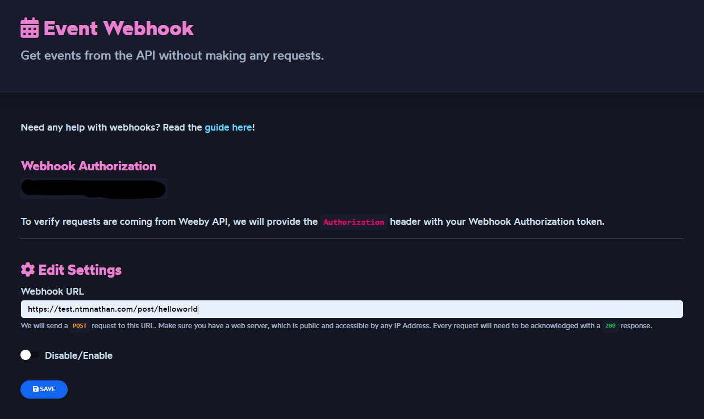
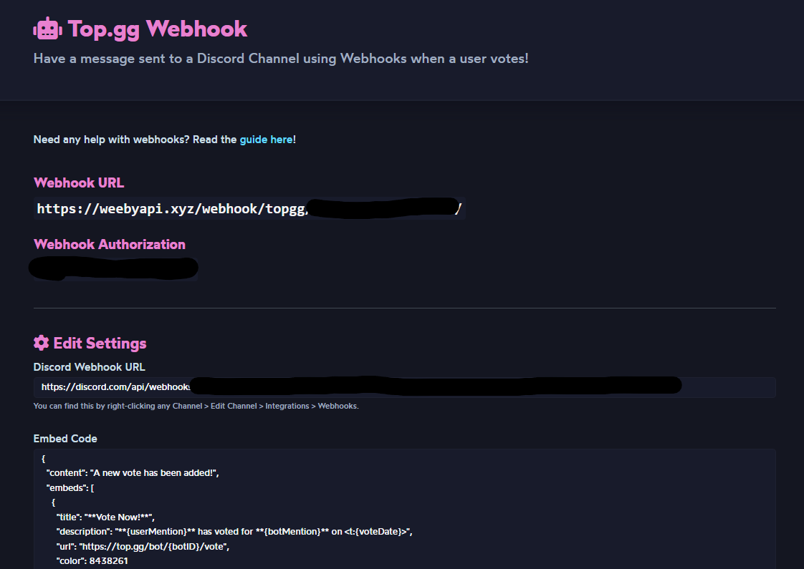
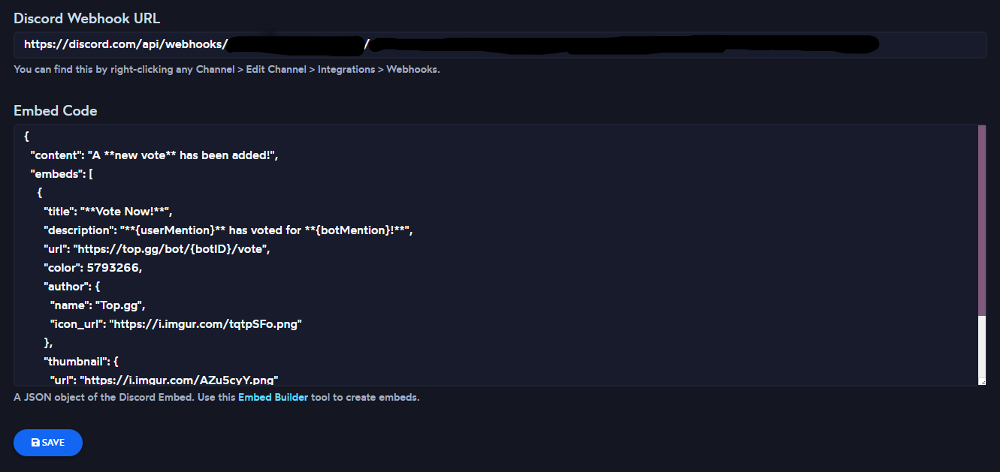
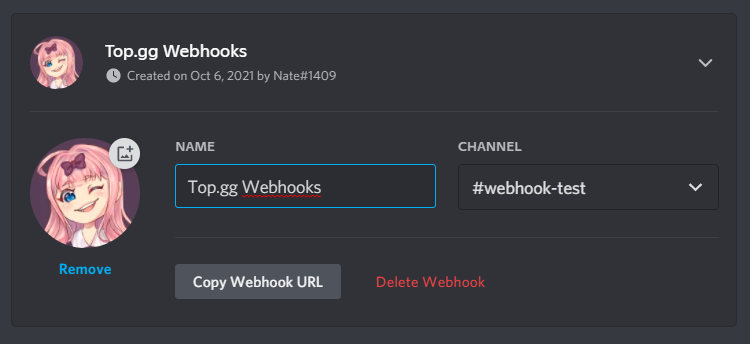
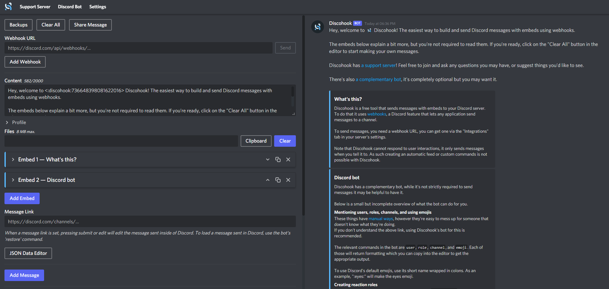
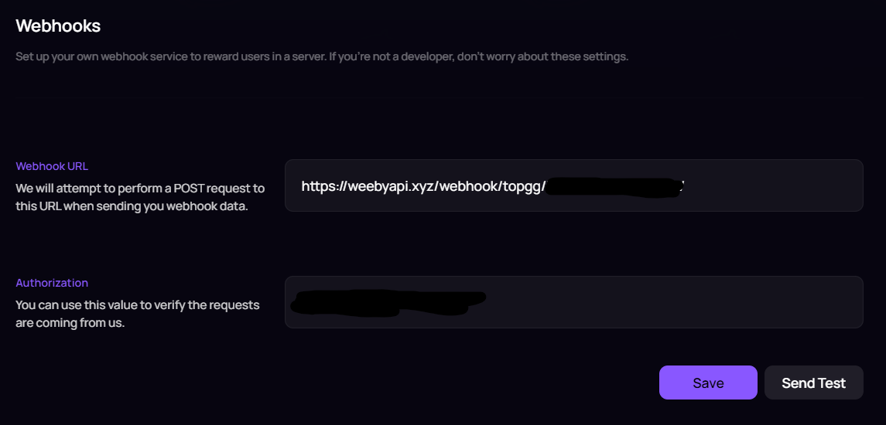
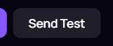
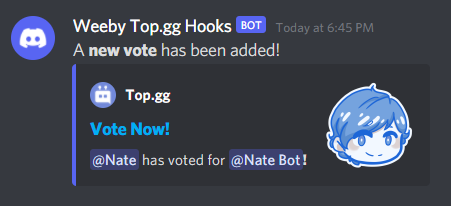

# Webhooks
Before you can start working with Webhooks, will need to go and visit the [Weeby API Dashboard](https://weebyapi.xyz/dashboard). Make sure that you are accepted first into Weeby API by applying for a token using the `/apply` command with the Weeby API bot, or using the [apply](https://weebyapi.xyz/dashboard/apply) page.

### Events
If you would like to receive updates from the API without making requests. You can setup our event webhook system to get events whenever a user votes your bot on [Top.gg](https://top.gg/), a new punishment was added and more. 
To verify requests are coming from Weeby API, we will provide the Authorization header with your Webhook Authorization token. It's recommended to verify every request to ensure it is coming from Weeby API.
Events sent by Weeby API must be acknowledged with a `200` response in order to be considered successful.

### Setting up Weeby API
First, make sure that you have a web server, which is public and accessible by any IP Address.
Scroll down to Settings, there you will find the Event Webhook section where you can start configuring the settings for event webhooks.



The options are as listed in the section:
- **Webhook Authorization** - You'll receive this upon being accepted into Weeby API, a unique Webhook Token for the Top.gg Webhook System and for our API Webhook Events system. (Don't use your API Token!).
- **Webhook URL** - This is the URL of your Web Server that Weeby API will send a `POST` request to. Localhost is not supported unless you use [ngrok](https://ngrok.io/).
- **Disable/Enable** - Toggle if you want events to be sent or not. If you are not using Event Webhooks, switch it off.
Fill in the details, and then click the <kbd>Save</kbd> button. Now events will be sent to that URL,

### Event Object
Top.gg Votes

<!-- eslint-skip -->
```js
{
    event: "vote"
    userID: String,
    botID: String,
    voteDate: Number,
    voteExpiry: Number,
    isWeekend: Boolean,
}
```

### Top.gg Voting
With Weeby API's Top.gg Webhook Integration, you will easily integrate the ability to have webhook messages sent to a Discord channel whenever a user votes for your bot on Top.gg
::: tip
To ensure the best experience, make sure that you follow this guide, the fields to have webhooks setup correctly to avoid issues such as not providing the token, or Message Spamming.
:::

::: danger
Do not use the Top.gg Webhook System for other bot list websites. It will not work because of the payload data, which leads to the webhook system breaking.
:::

### Setting up the Weeby API Webhook
Scroll down to **Settings**, there you will find the **Top.gg Webhook** section where you can start configuring Webhook functionality for your bot.
You will find the following details which you should not show anybody:



- **Webhook URL** - This is your Bot's Webhook URL where Top.gg will send `POST` requests to, along with the [payload](https://docs.top.gg/resources/webhooks/#bot-webhooks) data.
- **Webhook Authorization** - You'll receive this upon being accepted into Weeby API, a unique Webhook Token for the Top.gg Webhook System and for our API Webhook Events system. (Don't use your API Token!).

Now, while we are on this section. Fill in the following fields:



#### Discord Webhook URL
This is the Webhook URL that you can obtain by right-clicking any Channel > Edit Channel > Integrations > Webhooks. You will then need to create a Webhook, name it and provide a nice avatar for it.



Then, copy the Webhook URL and paste it in the **Discord Webhook URL** field. Do not show this to anybody because this contains the token and channel ID to make sending the content possible.

#### Embed Code
This is what the message will look like when it gets sent. Neat right? Well, to guarantee and ensure that the embeds are to be sent correctly without problems, use this [Embed Builder](https://discohook.org/) tool that is specialized for designing Discord Webhook messages.



When you're finished designing your embed, click on **JSON Data Editor** and copy the JSON code. Paste it into the **Embed Code** field.

Back on the dashboard, click <kbd>Save</kbd> and the page will reload with the new changes (shown on the fields).

### Setting Up Top.gg
The next step involved is going to your bot's webhook page on Top.gg, visit this link:
```:no-line-numbers
https://top.gg/bot/:BOTID/webhooks
```
Replace `:BOTID` with your Bot's ID.

When you are on this page, scroll down to **Webhooks**. Here you will need to fill in two fields that you have viewed on the dashboard earlier:
- Webhook URL
- Webhook Authorization



Click <kbd>Save</kbd>!

#### Testing
We're now ready to test our webhooks, to ensure the webhooks are working, click on the <kbd>Send Test</kbd> button.



You're all done with setting up! To see that your webhook message sent, go to the channel you created the webhook in and you'll see the webhook message.



### Embed Variables
You may use these embed variables to display certain data in the message. Variables will need to use curly braces `{}`.
To guarantee for mentions to render properly, make sure both the user and bot is in the server! Also, dates are returned as a Unix Timestamp so that it can work with [Discord message timestamps](https://discord.com/developers/docs/reference#message-formatting-timestamp-styles).

##### User
- `{userMention}` - String. The mention of the user
- `{userID}` - String. The ID of the user.

##### Bot
- `{botMention}` - String. The mention of the bot
- `{botID}` - String. The ID of the user.

##### Misc.
- `{voteDate}` - Number. The date when the user voted.

<br>

::: tip
For now, these are the only supported variables. In the future we may introduce ways to fetch full user and bot data and make it 100% customisable.
:::