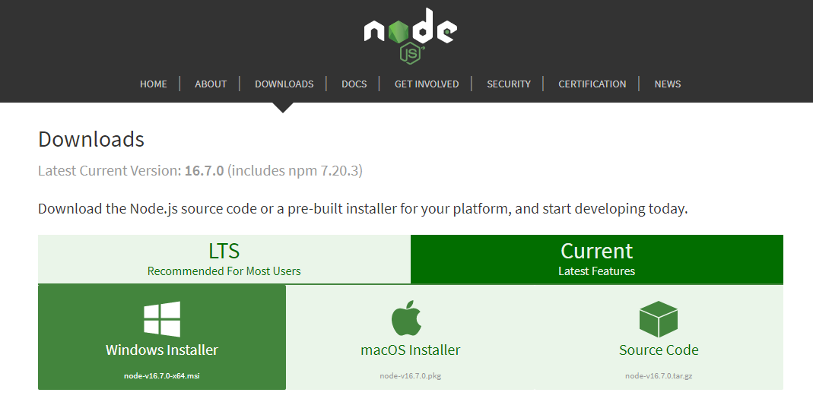

# Setup

1. Install Node.js v16.6 or higher by selecting the Current tab, and then "OS Name" Installer. This will also install NPM. [Click here](https://nodejs.org/en/download/current/) for the download page.


2. Install `weeby-js` with the following command:
```bash:no-line-numbers
npm install weeby-js --save
```

3. After you obtain a token from the Weeby API bot (via applying for one). Install the following NPM modules:
```bash:no-line-numbers
npm install dotenv
```

::: tip
If your platform is Windows and run into issues, then install Visual Studio C++ Build Tools 
```bash:no-line-numbers
npm i -g --add-python-to-path --vs2015 --production windows-build-tools
```
:::

4. Create a `.env` file and add the following variable:
```env:no-line-numbers
WEEBY_TOKEN=<your token>
```

5. Now, in your `index.js` file (or any other file), add the following code:
<!-- eslint-skip -->
```js
const WeebyAPI = require('weeby-js');
require('dotenv').config();

const weeby = new WeebyAPI(process.env.WEEBY_TOKEN);
```

6. You're ready to use Weeby-JS! check out the Weeby-JS examples to see how to integrate Weeby-JS functions in your project!